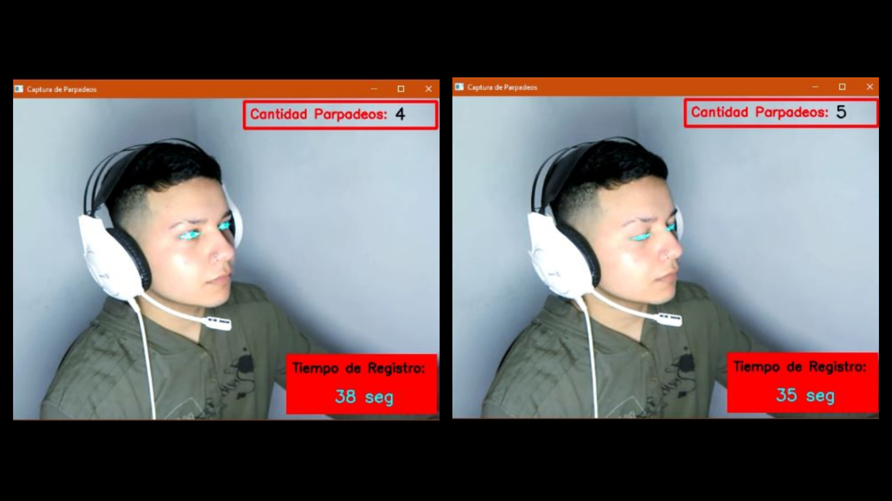
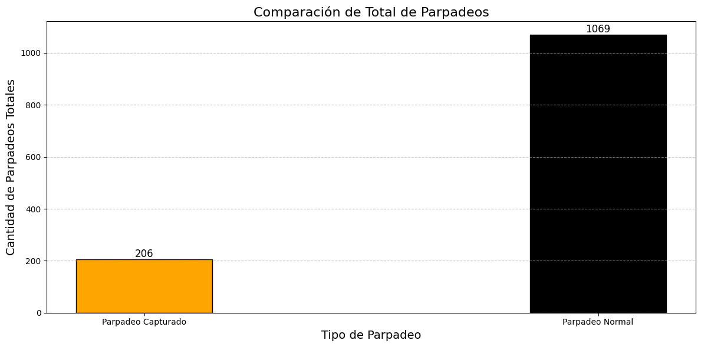
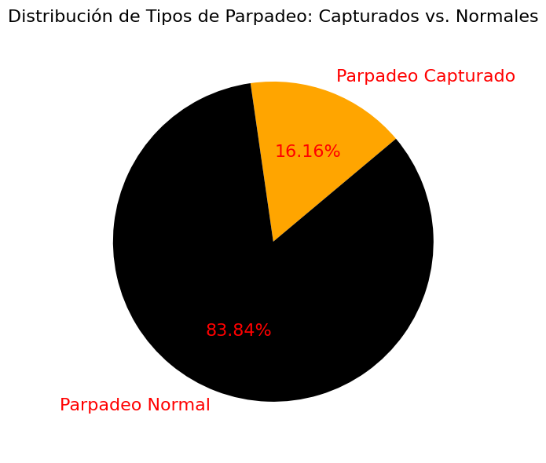
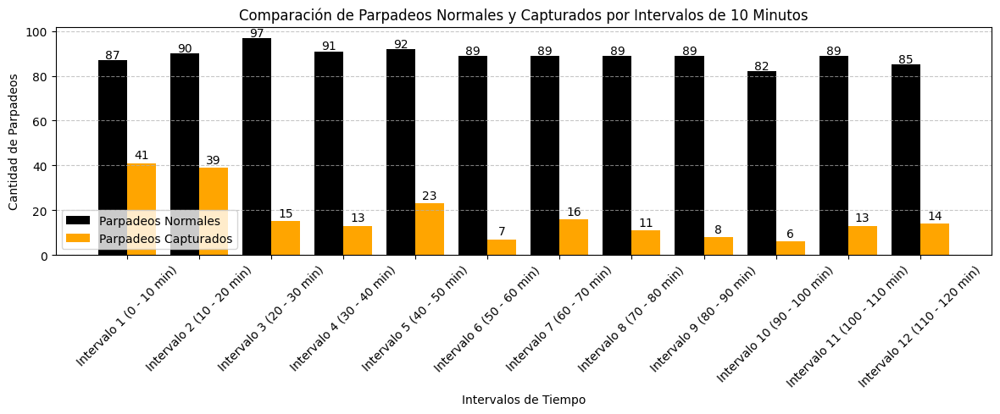
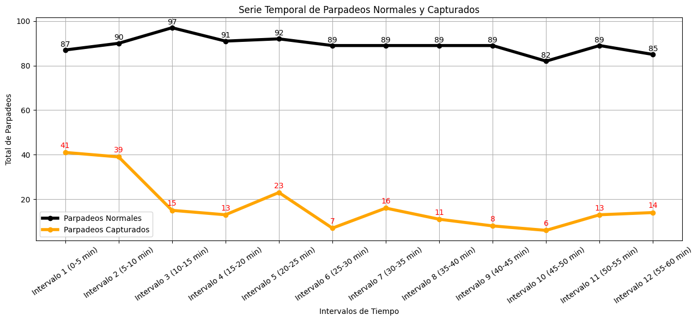

# 📊 Análisis de la Frecuencia de Parpadeo en Diferentes Entornos

## **Contenido**
- [Descripción del Proyecto](#descripción-del-proyecto)
- [Tecnologías y Librerías Utilizadas](#tecnologías-y-librerías-utilizadas)
- [Instalación de Librerías](#instalación-de-librerías)
- [Carga y Descripción del Dataset](#carga-y-descripción-del-dataset)
- [Gráficos de Análisis](#gráficos-de-análisis)
- [Conclusiones](#conclusiones)

## **Descripción del Proyecto**
Este proyecto explora cómo el entorno afecta la frecuencia de parpadeo, comparando un contexto normal con uno frente a la computadora. El parpadeo es un proceso fisiológico esencial para la salud ocular, ya que ayuda a mantener la superficie del ojo lubricada y protegida de irritantes. Sin embargo, investigaciones han mostrado que la frecuencia de parpadeo puede verse significativamente alterada al pasar tiempo prolongado frente a pantallas.

La exposición constante a dispositivos digitales puede llevar a una disminución en la frecuencia de parpadeo, lo que podría resultar en una serie de problemas oculares, como la fatiga visual, el síndrome de ojo seco y, en algunos casos, daños a largo plazo en la salud ocular. Estos problemas son especialmente relevantes en un mundo donde el uso de computadoras y dispositivos móviles se ha vuelto omnipresente, tanto en entornos laborales como en actividades de ocio.

A través de la recopilación y análisis de datos sobre la frecuencia de parpadeo en diferentes contextos, este proyecto busca responder a preguntas clave sobre la relación entre el uso de pantallas y la salud ocular. Se establece un contraste entre el parpadeo normal, que ocurre en un entorno sin pantallas, y el parpadeo capturado mientras una persona está utilizando un dispositivo, con el fin de identificar patrones y tendencias que puedan informar sobre la salud visual en la era digital.

El objetivo final de este estudio es promover la importancia del cuidado ocular, concienciando sobre la necesidad de realizar pausas regulares y adoptar prácticas saludables para mitigar los efectos adversos del uso prolongado de dispositivos electrónicos. Se espera que los resultados obtenidos no solo contribuyan a la comprensión de cómo el entorno digital afecta nuestra salud visual, sino que también sirvan como base para futuras investigaciones en esta área, fomentando un enfoque más consciente y saludable hacia el uso de tecnología.

## Demostración en YouTube

Puedes ver una demostración del proyecto en el siguiente enlace: [Análisis de Parpadeos con Visión Artificial](https://www.youtube.com/watch?v=IdHGOv9CN5k)


## **Tecnologías y Librerías Utilizadas**
- **Python**: Lenguaje de programación utilizado para generar los scripts para la captura y análisis de datos.
- **OpenCV**: Biblioteca utilizada para capturar los parpadeos en tiempo real frente a la pantalla.
- **Matplotlib**: Biblioteca para la visualización de datos, utilizada para generar los gráficos del análisis.
- **Pandas**: Biblioteca para la manipulación y análisis de datos, utilizada para estructurar y gestionar los datasets.

## **Instalación de Librerías**
Para instalar las librerías necesarias, se pueden utilizar los siguientes comandos en la terminal:

```
pip install opencv-python matplotlib pandas

```

## **Carga y Descripción del Dataset**
Los datasets utilizados en este análisis se generaron mediante un script en Python, utilizando la biblioteca OpenCV para la captura de parpadeos. Esta metodología permite obtener datos precisos sobre la frecuencia de parpadeo en diferentes entornos, facilitando la comparación entre el uso de pantallas y condiciones normales sin pantallas. Los datasets generados están disponibles en mi repositorio de GitHub para facilitar la reproducibilidad del estudio.

### Proceso de Captura de Parpadeo
Para la captura de parpadeos, se desarrolló un script en Python que utiliza OpenCV, una biblioteca ampliamente utilizada para la visión computarizada. Esta herramienta permite detectar características faciales y movimientos oculares en tiempo real. El script está diseñado para activar la cámara y monitorizar el rostro del usuario, identificando específicamente los ojos. Se implementó un temporizador programado que registra cada parpadeo detectado durante un período de 60 minutos, almacenando estos datos en un dataset.

OpenCV utiliza modelos preentrenados para detectar los ojos y rastrear su apertura y cierre. Durante el proceso, se identifican puntos clave en el área de los ojos, lo que permite calcular cuándo se produce un parpadeo. Este sistema de visión artificial es fundamental, ya que permite que el script opere de manera efectiva, incluso en condiciones de iluminación variadas.

El resultado de esta captura de datos es un registro de la frecuencia de parpadeo, que se almacena en el dataset llamado **registros_parpadeo_capturado**. La recolección de datos en tiempo real proporciona una visión más precisa de cómo el uso de pantallas puede afectar la salud ocular.

Para ilustrar el proceso, se incluye la imagen `captura_parpadeo.JPG`, que muestra dos estados de los ojos: uno con los ojos abiertos, donde se pueden observar los seis puntos que OpenCV detecta, y otro con los ojos cerrados. Esta comparación visual resalta cómo se incrementa la cantidad de parpadeos en diferentes contextos. 



### Nombres de los Datasets y Estructura
1. **registros_parpadeo_capturado**:
   - **Descripción**: Este dataset contiene registros de parpadeo capturados mientras estaba frente a la computadora durante 60 minutos. Cada entrada incluye el momento específico en que se detectó un parpadeo.
   - **Columnas**: 
     - `Fecha y Hora del Parpadeo Capturado`: Indica la fecha y hora exacta en que se produjo cada parpadeo.

2. **registros_parpadeo_normal**:
   - **Descripción**: Este dataset simula la frecuencia de parpadeo en un ambiente sin pantalla, donde se generan parpadeos aleatorios entre 15 y 20 por minuto. Esto permite establecer una línea base para la comparación.
   - **Columnas**: 
     - `Fecha y Hora del Parpadeo Normal`: Contiene registros de parpadeos generados aleatoriamente en un ambiente normal, sin influencia de pantallas.

La disponibilidad de estos datasets y la metodología utilizada en la captura permiten replicar el estudio y fomentar investigaciones adicionales en el área de la salud ocular y el uso de tecnología.


## **Gráficos de Análisis**

### 1. Comparación Total de Parpadeos en 60 Minutos
Se comparan los totales de parpadeos registrados en ambos contextos para observar las diferencias en la frecuencia de parpadeo.


### 2. Distribución de Tipos de Parpadeos
Este análisis compara la frecuencia de dos tipos de parpadeo: aquellos que ocurren en condiciones normales y aquellos capturados mientras una persona está frente a una pantalla.


### 3. Comparación en Intervalos de 10 Minutos
Se organizan los datos en intervalos de 10 minutos para realizar un análisis detallado de cómo evoluciona la frecuencia de parpadeo a lo largo del tiempo.


### 4. Comparación en Intervalos de 5 Minutos
Este gráfico complementa el análisis anterior, proporcionando una comparación más detallada en intervalos de 5 minutos.



## **Conclusiones**
El análisis realizado ha permitido observar diferencias significativas en la frecuencia de parpadeos bajo condiciones de trabajo frente a una pantalla en comparación con un entorno sin pantalla. Los gráficos representativos han mostrado que, durante el periodo de estudio, los parpadeos normales se mantuvieron relativamente estables, mientras que los parpadeos capturados disminuyeron, lo que sugiere que el tiempo prolongado frente a la computadora está relacionado con una reducción en la frecuencia de parpadeo. Este hallazgo tiene implicaciones importantes para la salud ocular, ya que indica que el enfoque en tareas visuales puede alterar los comportamientos naturales de parpadeo.

Es crucial considerar los efectos de la fatiga ocular en entornos de intensa concentración. Por lo tanto, se recomienda implementar prácticas saludables, como programar pausas regulares y lubricar los ojos en caso de resequedad. En caso de experimentar incomodidad ocular, es aconsejable consultar a un profesional de la salud para recibir la orientación adecuada.

La disponibilidad de los datasets generados y los scripts de captura permite replicar este estudio, promoviendo investigaciones adicionales en esta área. Así, este proyecto no solo se centra en el análisis exploratorio de datos y la visión computarizada, sino que también traduce situaciones de la vida real en un análisis concreto y aplicable, fomentando una práctica consciente que priorice la salud ocular en un mundo cada vez más digital.

## **Agradecimientos**
Gracias por leer este análisis. Espero que haya sido informativo y contribuya a fomentar hábitos más saludables en el uso de la tecnología. 🙏
Estoy abierto a recibir contribuciones y sugerencias que puedan ampliar la información presentada en este estudio. La investigación en este campo es continua, y siempre hay espacio para aprender más sobre la salud ocular y el impacto del entorno digital en nuestros hábitos visuales. 

Agradezco cualquier aporte que enriquezca esta área de estudio y me permita seguir en el camino del aprendizaje y la mejora personal.
